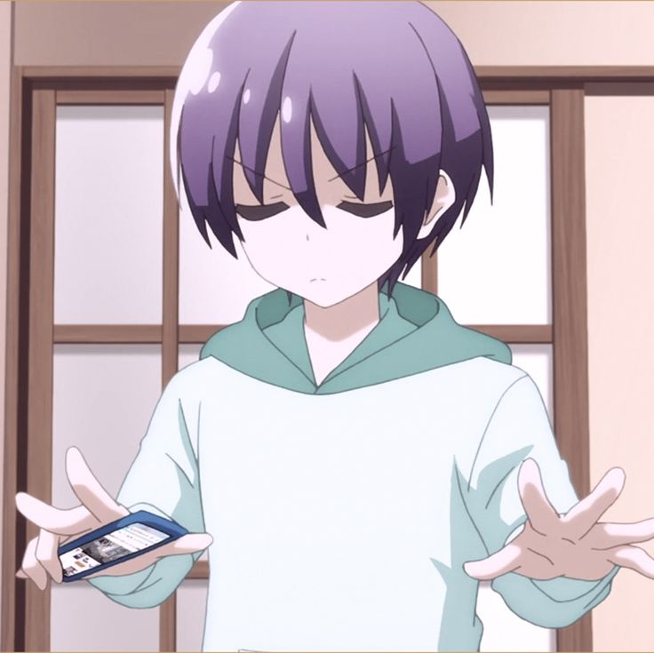

  

<h1 align="center">Hi — I'm Odokaa (オドカー) ✨</h1>

Anime lover • Software & app creator • Visual tinkerer

  

  <strong>❤ I'm currently working on software, app development, and web creation.</strong>

---

## About Me

- I blend modern software engineering with anime-inspired visuals and playful UX.
- I prototype mobile apps, creative UIs, and small interactive experiences.
- Location: Mongolia — open to remote collaborations.

## Quick Links

- Website: https://www.otech.mn
- Secondary: https://www.tsukinosutaa.com
- Instagram: https://www.instagram.com/odokaa0403/
- Facebook: https://www.facebook.com/Odokaa0403/
- Email: od-ochir.o@otech.mn
- GitHub: https://github.com/XING-io-ufe

## Current Focus

- Working on: a cute, animated portfolio app (Next.js + Vercel + Lottie)
- Backend: REST API with MySQL
- Learning: advanced shader effects and creative generative UI
- Open to: small freelance projects, collabs, concept art coding

## Tech Stack

- Frontend: Next.js, React, TypeScript
- Mobile: Flutter, React Native
- Backend / DB: Node.js, REST API, MySQL, PostgreSQL
- Languages: C++, Python, JavaScript / TypeScript
- Deployment / Tools: Vercel, Docker, Git, CI/CD, Figma

## Favorite Anime & Inspirations

- My current top pick: Tensei shitara Slime Datta Ken
- Inspirations for visuals and mood: Violet Evergarden, Made in Abyss, cozy slice-of-life

## Featured Projects

- Cute Portfolio — an animated showcase of micro-projects (link coming soon)
- Mobile Mini-Game — a small playful prototype blending UI + physics
- (Add repo links and short descriptions here)

## How to Collaborate

- Want a collab or idea? DM on Instagram or open an issue on GitHub.
- For hired work or consults: email od-ochir.o@otech.mn

## Fun Corner

- Mood: 🌸 + ☕
- Theme: Pastel gradients, chibi sprites, soft motion
- Tips: I love tiny delightful details — hover animations, confetti, and playful easter eggs.

---

  

  <strong>Let's make something adorable and useful — say hi!</strong>

